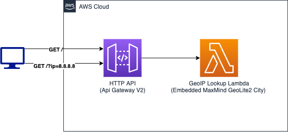

# quick and dirty serverless geoip api

Simple serverless service (built with AWS CDK) for translating an IP address to GeoIP data using a locally downloaded MaxMind MMDB database.

During deployment you provide a MaxMind license key which is used to automatically retrieve and bundle up the latest MaxMind GeoLite2 City MMDB within the Lambda function.


## Architecture




## Prequisites

* [Git](https://git-scm.com/) (of course)
* [AWS Account](https://portal.aws.amazon.com/billing/signup#/)
* [AWS CLI](https://docs.aws.amazon.com/cli/latest/userguide/cli-configure-quickstart.html#cli-configure-quickstart-config)
* [Node 14.x](https://nodejs.org/en/download/)
* [(Free) MaxMind License Key](https://www.maxmind.com/en/geolite2/signup)


## Setup: Deployment

```bash
# Clone the repo
git clone https://github.com/aaronbrighton/quick-and-dirty-serverless-geoip-api.git
cd quick-and-dirty-serverless-geoip-api

# Install application dependencies
npm install

# Bootstrap your environment
npx cdk bootstrap

# Deploy the app
npx cdk deploy --context maxMindLicenseKey=l***********w
```


## Usage: Get details for an IP

Using the `sampleApiEndpoint` output from the `cdk deploy` command in the previous section:

### Option 1: Your IP
```
# curl -s "https://g*********h.execute-api.us-east-1.amazonaws.com/" | jq
{
  "continent": {
    "code": "NA",
    "geonameId": 6255149,
    "names": {
      "de": "Nordamerika",
      "en": "North America",
      "es": "Norteamérica",
      "fr": "Amérique du Nord",
      "ja": "北アメリカ",
      "pt-BR": "América do Norte",
      "ru": "Северная Америка",
      "zh-CN": "北美洲"
    }
  },
  "country": {
    "geonameId": 6252001,
    "isoCode": "US",
    "names": {
      "de": "USA",
      "en": "United States",
      "es": "Estados Unidos",
      "fr": "États-Unis",
      "ja": "アメリカ合衆国",
      "pt-BR": "Estados Unidos",
      "ru": "США",
      "zh-CN": "美国"
    }
  },
  "registeredCountry": {
    "geonameId": 6252001,
    "isoCode": "US",
    "names": {
      "de": "USA",
      "en": "United States",
      "es": "Estados Unidos",
      "fr": "États-Unis",
      "ja": "アメリカ合衆国",
      "pt-BR": "Estados Unidos",
      "ru": "США",
      "zh-CN": "美国"
    },
    "isInEuropeanUnion": false
  },
  "traits": {
    "isAnonymous": false,
    "isAnonymousProxy": false,
    "isAnonymousVpn": false,
    "isHostingProvider": false,
    "isLegitimateProxy": false,
    "isPublicProxy": false,
    "isResidentialProxy": false,
    "isSatelliteProvider": false,
    "isTorExitNode": false,
    "ipAddress": "8.8.8.8",
    "network": "8.8.0.0/17"
  },
  "location": {
    "accuracyRadius": 1000,
    "latitude": 37.751,
    "longitude": -97.822,
    "timeZone": "America/Chicago"
  }
}
```

### Option 2: Supply an IP
```
# curl -s "https://g*********h.execute-api.us-east-1.amazonaws.com/?ip=8.8.8.8" | jq
{
  "continent": {
    "code": "NA",
    "geonameId": 6255149,
    "names": {
      "de": "Nordamerika",
      "en": "North America",
      "es": "Norteamérica",
      "fr": "Amérique du Nord",
      "ja": "北アメリカ",
      "pt-BR": "América do Norte",
      "ru": "Северная Америка",
      "zh-CN": "北美洲"
    }
  },
  "country": {
    "geonameId": 6252001,
    "isoCode": "US",
    "names": {
      "de": "USA",
      "en": "United States",
      "es": "Estados Unidos",
      "fr": "États-Unis",
      "ja": "アメリカ合衆国",
      "pt-BR": "Estados Unidos",
      "ru": "США",
      "zh-CN": "美国"
    }
  },
  "registeredCountry": {
    "geonameId": 6252001,
    "isoCode": "US",
    "names": {
      "de": "USA",
      "en": "United States",
      "es": "Estados Unidos",
      "fr": "États-Unis",
      "ja": "アメリカ合衆国",
      "pt-BR": "Estados Unidos",
      "ru": "США",
      "zh-CN": "美国"
    },
    "isInEuropeanUnion": false
  },
  "traits": {
    "isAnonymous": false,
    "isAnonymousProxy": false,
    "isAnonymousVpn": false,
    "isHostingProvider": false,
    "isLegitimateProxy": false,
    "isPublicProxy": false,
    "isResidentialProxy": false,
    "isSatelliteProvider": false,
    "isTorExitNode": false,
    "ipAddress": "8.8.8.8",
    "network": "8.8.0.0/17"
  },
  "location": {
    "accuracyRadius": 1000,
    "latitude": 37.751,
    "longitude": -97.822,
    "timeZone": "America/Chicago"
  }
}
```